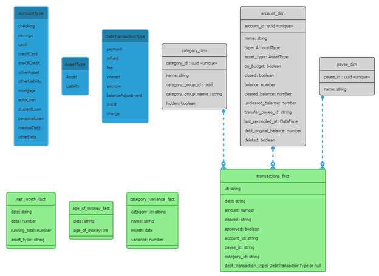

[](https://classroom.github.com/online_ide?assignment_repo_id=12156503&assignment_repo_type=AssignmentRepo)
# CSCI 622 Project - YNAB Data Pipeline

You Need a Budget ([YNAB](https://ynab.com)) is a personal budgeting software that allows users to make budgets and then track transactions to stay on that plan. Although the software is great at budgeting and transaction tracking, its reporting functionality is limited. By extracting and cleaning the data, a power bi report can be created to show robust analytics including things like a slowing changing dimension to compare the changes in a budget from the beginning of the month to the end when it is closed out.

# Getting started

## Architecture change log
There has been several architectural changes to the app, the changes are captured in [./docs/decision_history](./docs/decision_history).

## Prerequisites
In order for this project to work, you must follow the steps below:

1. Create a [Azure Subscription](https://learn.microsoft.com/en-us/azure/cost-management-billing/manage/create-subscription)
1. Install the [Azure CLI](https://learn.microsoft.com/en-us/cli/azure/install-azure-cli)
1. Install the [Azure Bicep](https://learn.microsoft.com/en-us/azure/azure-resource-manager/bicep/install)
1. Install [Azure Functions Core Tools](https://learn.microsoft.com/en-us/azure/azure-functions/functions-run-local?tabs=windows%2Cisolated-process%2Cnode-v4%2Cpython-v2%2Chttp-trigger%2Ccontainer-apps&pivots=programming-language-powershell#install-the-azure-functions-core-tools)
1. For local development, create local settings file `src/local.settings.json`, it should have the following at a minimum

``` json
{
  "IsEncrypted": false,
  "Values": {
    "FUNCTIONS_WORKER_RUNTIME": "python",
    "AzureWebJobsFeatureFlags": "EnableWorkerIndexing",
    "AzureWebJobsStorage": "The storage account connection string",
    "YNAB_BASE_ENDPOINT":"https://api.ynab.com/v1/",
    "YNAB_USER_TOKEN_KEY":"Your YNAB user token",
    "YNAB_BUDGET_ID":"Your budget id"
  }
}
```

## Deploy Infrastructure

- create `local.parameters.json` based on `sample.parameters.json` adding the following keys. This step can omitted if you want to enter the params during the deployment
  - `ynabUserToken`
  - `ynabBudgetId`
- open this directory in a terminal
- run 
``` PowerShell
az deployment sub create --location southcentralus --template-file .\ynab-data-pipeline.bicep --parameters .\local.parameters.json
```
  - Note: if you omit `--parameters` then you will be prompted to enter required parameters. The command would be 
``` PowerShell
az deployment sub create --location southcentralus --template-file .\ynab-data-pipeline.bicep
```

## Deploy Function

`# Deploy the function app code
run `./script/deploy.ps1`

Note: you may need to unblock powershell script execution on your machine, you can do it by running the following command `Set-ExecutionPolicy -ExecutionPolicy Undefined -Scope CurrentUser`

## YNAB Api User Token

The YNAB Api token must be fetched from the YNAB application (see [quick start](https://api.ynab.com/)). After the token is fetched it must be added to the create Azure Key Vault. In addition, you must get the budget to the run the pipeline from the YNAB application url (`https://app.ynab.com/{Take this value}/budget/202310`, the value should like this `f2b1c1f9-5d5d-4e2d-8c6e-9c2b7d5c4d6e`, the full url would be `https://app.ynab.com/f2b1c1f9-5d5d-4e2d-8c6e-9c2b7d5c4d6e/budget/202310`).

After the values are collected, they need to be stored in the create Azure Key Vault. Deploy the infrastructure to get the values properly in KeyVault and app settings.


## Power BI

Install [Power BI Desktop](https://learn.microsoft.com/en-us/power-bi/fundamentals/desktop-get-the-desktop)

The power bi template located in the root of this repo (`./Financial Snapshot.pbit`) has several pre built reports ready to use, simply open, set the storage account name, and use your Azure Credentials to authorize the storage account.

Note: if the Azure function has not run all the reports will be empty. You can trigger manually from the portal or wait for the time trigger to run.

## Local Development

1. [Configure your environment](https://learn.microsoft.com/en-us/azure/azure-functions/create-first-function-vs-code-python?pivots=python-mode-decorators#configure-your-environment)
1. open `./src` in vscode
1. Configure a virtual env in `./src`, run `python -m venv .venv` in `./src`
1. press F5 to run locally (ensure `local.settings.json` is configured before hand)

# Ingestion (Bronze Tier)

Note: to use mocked data, change the function application settings `YNAB_BASE_ENDPOINT` to `https://<functionName>.azurewebsites.net/api/mocks/`. This load static files from the function itself that should demonstrate the pipeline

## Source

the [YNAB API](https://api.ynab.com/v1) provides all of the necessary endpoints to get data from. Below are the specific endpoints currently used.

### Get Transactions

**Specification:** [Get Transactions](https://api.ynab.com/v1#/Transactions/getTransactions)

**Description of use:** after the data is cleaned it is used for the bulk of the analysis downstream.

**Poll Frequency:** Daily at 0242 CST  
**Durability:** Replaced daily  
**Storage Type:** Raw payload  
**Storage Location:** `ynab/raw/transactions.json`
### Get Accounts

**Specification:** [Get Accounts](https://api.ynab.com/v1#/Accounts/getAccounts)

**Description of use:** Holds two important pieces of information, the type of the account (asset vs liability) and if it is a debt account, the interest rate and minimum payment information. Also used to validate the clean of the transactions.

**Poll Frequency:** Daily at 0242 CST  
**Durability:** Replaced daily  
**Storage Type:** Raw payload  
**Storage Location:** `ynab/raw/accounts.json`

### Get Budget Month

**Specification:** [Get Budget Month](https://api.ynab.com/v1#/Months/getBudgetMonth)

**Description of use:** Used to get the budgeted amount on for each category every month

**Poll Frequency:** Each month is polled daily at 0242 CST from the 16th of the previous month to the 15th of the current month. For an example, on 14 October 2023, the Budget for September 2023 and October 2023 will be polled and stored. On 20 October 2023, the Budget for October 2023 and November 2023 will be polled and stored. The reason for this is that a user may be fixing there budget a couple of days into the next month and we want to capture the changes. (TODO: decide if I want to update this to only poll a month from the first day of the month to the 15th of the next month)  
**Durability:** Replaced daily  
**Storage Type:** Raw payload  
**Storage Location:** `ynab/raw/month/{BudgetMonth}/{RunDay}.json`

# Transformation (Silver Tier)

items in the same step happen in parallel.

## (Step 1) un-nest sub transactions

Azure Function Name: `unnest_subtransactions`

The first step in the transformation process is to read transactions and run a few transformations to clean the raw payload into a more usable state. There are three things that happen in this step.

*File Path*: `silver/transactions.snappy.parquet`

*Schema:*
| Key                    | Type          |
|------------------------|---------------|
| id                     | str           |
| date                   | datetime64[ns]|
| amount                 | number        |
| memo                   | str           |
| cleared                | str           |
| approved               | boolean       |
| flag_color             | str           |
| account_id             | str           |
| account_name           | str           |
| payee_id               | str           |
| payee_name             | str           |
| category_id            | str           |
| category_name          | str           |
| transfer_account_id    | str           |
| transfer_transaction_id| str           |
| debt_transaction_type  | str           |


### Hydrate Debt Account Interest and Escrow transactions

Debt Accounts are a special account type in YNAB in that they calculate the current balance of the debt using information about the interest rate, escrow amount, and current balance. Because the balance is calculated, the interest and escrow transactions do not appear in the transactions list returned from the api. As such, we need to calculate these values and insert the transactions into the transaction list. The steps to calculate follow this algorithm.

1. Find accounts with a `debt_interest_rate` present.
1. Group all transactions by month and order ascending.
1. Loop through the months and create transactions by applying interest and escrow to that month.

Notes:
* interest is stored as Annual Percentage Rate (APR), as such, when we are applying interest we need to divide by 12 to get the monthly interest rate.
* escrow amounts may or may not be present on the debt account, as such, we check for presence before we try and apply.

### Un-nest sub-transactions

Sub transactions are splits on the primary transaction amount. We need to un-nest all sub-transactions and replace the parent transaction with the children so that the reporting matches how the money was spent, and not a ledger on how the transactions appear in the bank account

### Remove unneeded fields

after we un-nest the sub-transactions, we remove unnecessary fields and upload to blob storage (path: `silver/transactions.snappy.parquet`) as a parquet file so that downstream jobs can process farther. We push it back to storage at this so that future steps can process the data in parallel.


## Clean Accounts

accounts are transformed into the schema defined below and uploaded to `silver/accounts.snappy.parquet`. miliunits are converted to float (2 decimal places)

*File path:* `silver/accounts.snappy.parquet`
*Schema:*
| Field Name | Data Type |
|------------|-----------|
| id         | str       |
| name       | str       |
| type       | str       |
| on_budget  | bool      |
| closed     | bool      |
| note       | str       |
| balance    | float     |
| cleared_balance | float |
| uncleared_balance | float |
| deleted    | bool      |

## Clean Previous Month Categories

previous budget month categories are transformed into the schema defined below and uploaded to `silver/budget_months/{month}.snappy.parquet`. Miliunits are converted to float (2 decimal places), categories are unnested and have month and snapshot date appended to each category.

*File path:* `silver/budget_months/{month}.snappy.parquet`

*Schema:*
| Field Name | Data Type |
|------------|-----------|
| id         | str       |
| month      | datetime64[ns] |
| snapshot_date | datetime64[ns] |
| category_group_id | str |
| category_group_name | str |
| name       | str       |
| hidden     | bool      |
| budgeted   | bool      |
| activity   | bool      |
| balance    | bool      |

# Gold

This step creates the final tables that will be brought into Power BI. The final schema is as follows:



## Steps:

All steps run in parallel.

### Transactions Fact

Azure Function Name: `create_transactions_fact_activity`

This step reads the cleaned transactions from `silver/transactions.snappy.parquet` and drops unneeded columns

*File Path*: `gold/transactions_fact.snappy.parquet`

*Schema:*

| Key                    | Type    |
|------------------------|---------|
| id                     | str     |
| date                   | str     |
| amount                 | number  |
| account_id             | str     |
| payee_id               | str     |
| category_id            | str     |
| debt_transaction_type  | str     |

<!-- TODO: move category_group_id to this table, doesn't make a difference in power bi, but I think it would be a little cleaner -->

### Category Dim

Azure Function Name: `serve_category_dim_activity`

This step reads the latest budget month from `silver/budget_months/{month}.snappy.parquet` and drops unneeded columns. we pull from the latest month since that will have the latest changes (add/delete categories) allow us to properly hydrate the category dim

*File Path*: `gold/categories_dim.snappy.parquet`

*Schema:*

| Field Name | Data Type |
|------------|-----------|
| category_id| str       |
| category_group_id | str |
| category_group_name | str |
| name       | str       |
| hidden     | bool      |


### Accounts Dim

Azure Function Name: `serve_accounts_dim_activity`

This step reads from `silver/accounts.snappy.parquet` and drops unneeded columns. Also during this step, the account type is mapped to asset/liability based on ynab account type.

*File Path*: `gold/accounts_dim.snappy.parquet`

*Schema:*

| Field Name | Data Type |
|------------|-----------|
| account_id | str       |
| name       | str       |
| type       | str       |
| on_budget  | bool      |
| closed     | bool      |
| balance    | float     |
| deleted    | bool      |
| asset_type | str       |

### Payee Dim

Azure Function Name: `serve_payee_dim_activity`

This step reads from `silver/transactions.snappy.parquet` and derives payees from actual spending.

*File Path*: `gold/payee_dim.snappy.parquet`

*Schema:*

| Field Name | Data Type |
|------------|-----------|
| payee_id   | str       |
| name       | str       |


## Additional Tables

### Category SCD

Azure Function Name: `serve_category_scd_activity`

This step reads all the budget months from `silver/budget_months/{month}.snappy.parquet` and creates a slowly changing dimension for category_name and budgeted_amount. 

*File Path*: `gold/category_scd.snappy.parquet`

*Schema:*

| Field Name | Data Type |
|------------|-----------|
| id| str       |
| name       | str       |
| category_group_id | str |
| category_group_name | str |
| hidden     | bool      |
| budgeted   | number    |
| month      | datetime64[ns] |
| start_date | datetime64[ns] |
| end_date   | datetime64[ns] |

### Age Of Money Fact

Azure Function Name: `serve_age_of_money_activity`

This step reads from `silver/transactions.snappy.parquet` and calculates the daily age of money based on the first in/first out method that YNAB uses to determine how long from when we receive money do we spend it. A good overview of this method is outlined in [this](https://www.reddit.com/r/ynab/comments/c5rw4b/how_is_age_of_money_calculated/es4dgni/) reddit post.

*File Path*: `gold/age_of_money_fact.snappy.parquet`

*Schema:*

| Field Name   | Data Type      |
|--------------|-----------     |
| date         | datetime64[ns] |
| age_of_money | str            |

### Net Worth Fact

Azure Function Name: `serve_net_worth_fact_activity`

This step reads from `gold/transactions_fact.snappy.parquet` and `gold/accounts_dim.snappy.parquet` and calculates the monthly change in net worth. This table makes things quite a bit easier in power by instead of having to derive everything in power query

*File Path*: `gold/monthly_net_worth_fact.snappy.parquet`

*Schema:*

| Field Name   | Data Type      | Notes                  |
|--------------|----------------|------------------------|
| date         | datetime64[ns] |                        |
| delta        | number         |the change in net worth |
| asset_type   | str            | asset/liability        |
| liability_running_total | number | the running total of liabilities, only applicable on liability rows |
| asset_running_total | number | the running total of asset, only applicable on asset rows |
| running_total | number | the running total |


# Validation

the validation strategy is straight forward, the balance in accounts_dim represents the actual account balance in YNAB, as such we can use this balance to validate that our summations are correct.

Note: I found a bug in YNAB's API that I am unable to properly hydrate the escrow amounts on my mortgage, this may or may not effect your data. If it does then this validation will fail. with manual correction, I am still off about two cents on the balance for the mortgage account, it is likely due to the fact that I have not properly reverse engineered there round logic. Future efforts will fix this, but the validation will also fail for that reason.

## Validate Transactions Fact

*inputs*
* `gold/transactions_fact.snappy.parquet`
* `gold/accounts_fact.snappy.parquet`

*Validates* the balance of each account


## Validate Net Worth Fact
*inputs*
* `gold/net_worth_fact.snappy.parquet`
* `gold/accounts_fact.snappy.parquet`

*Validates* the sum of account balance vs the sum of the delta in the net worth fact